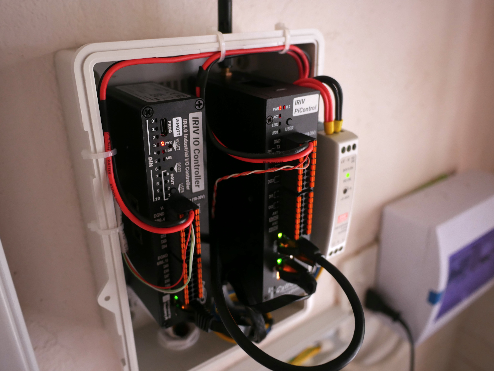
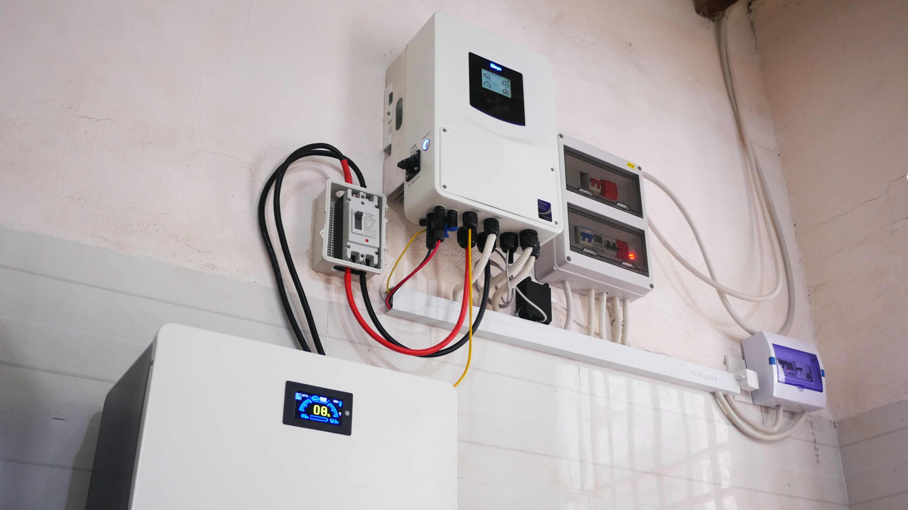

# Deye SG06 Inverter RS485 Monitor

Monitor **Deye SG06 Inverter** (dòng SG05/SG06) qua **Modbus RTU (RS485)** trên cổng datalogger. Repo này gồm bản đồ thanh ghi, file import Cytron IRIV IOC MQTT Gateway, ví dụ master ESPHome / ESP32 + RS485, emulator slave trên PC, Mosquitto Docker cho MQTT, gói Home Assistant và dashboard web MQTT.



> English: [README.md](README.md)  
> Ghi chú agent: [AGENTS.md](AGENTS.md) · [docs/HANDOFF.md](docs/HANDOFF.md)

**Dự án chị em:** [jk-pb-rs485-monitor](../jk-pb-rs485-monitor) — BMS JK-PB* Modbus (bus / baud riêng).

---

## Dự án này làm gì

1. Giao tiếp với biến tần như Modbus **slave** (bạn là **master**).
2. Dùng địa chỉ holding register từ PDF protocol của Deye, kèm scale **đã kiểm chứng thực tế** trên SG06.
3. Publish / hiển thị số liệu realtime: pin, PV1/PV2, lưới, tải, công suất / tần số / nhiệt độ inverter, và bộ đếm năng lượng theo ngày.

PDF protocol: [`docs/protocol/Deye SG05 Modbus Protocol.V118.pdf`](docs/protocol/Deye%20SG05%20Modbus%20Protocol.V118.pdf)

### Tham số bus

| Tham số | Giá trị |
|---------|---------|
| Baud | **9600** 8N1 |
| Slave ID | **1** |
| Function code | 03 (đọc), 10 (ghi) |
| Cổng | **RS485** datalogger / meter — không phải RJ45 **CAN** của BMS |

**Một Modbus master trên mỗi bus RS485.** Chỉ chạy IRIV **hoặc** ESPHome/ESP32 trên cặp A/B đó — không chạy cả hai.

### Hiệu chỉnh thanh ghi đã kiểm chứng (SG06)

| Chủ đề | Reg | Scale / ghi chú |
|--------|-----|-----------------|
| Charge / Discharge hôm nay | **70** / **71** | 0.1 kWh (**70 = charge**) |
| Dòng PV | 110, 112 | **0.1** A |
| Dòng lưới | 160 | **0.01** A |
| Dòng tải | **179** | 0.01 A |
| Công suất tải | 178 | 1 W |
| Tần số inverter | 193 | 0.01 Hz |
| Nhiệt độ pin / inverter | 182, 91 | 0.1, offset **-100** |

Firmware IRIV IOC **trước V1.2.6**: bật job poll **thứ 27** khiến gateway reboot và xóa hết job. **V1.2.6** đã sửa.

---

## Đường phần cứng

### A — Cytron IRIV IOC MQTT Gateway (RS485 → MQTT)

```text
Deye SG06 (slave 1) --RS485@9600--> IRIV IOC (master) --MQTT--> Mosquitto
                                                              |--> Home Assistant
                                                              |--> web/ dashboard (WS :9001)
```

Hướng dẫn đầy đủ: [`iriv-ioc-mqtt-gateway/README-vn.md`](iriv-ioc-mqtt-gateway/README-vn.md) · [English](iriv-ioc-mqtt-gateway/README.md)  
(Firmware Cytron mới nhất, Mosquitto Docker, restore USB tại `http://10.0.0.1`, HA MQTT + File Editor.)

### B — ESP32 / ESPHome + transceiver RS485 (RS485 → ESPHome / HA)

```text
Deye SG06 (slave 1) --RS485@9600--> ESP32/NodeMCU + MAX3485 (master) --Wi‑Fi--> Home Assistant (ESPHome API)
```

Nối dây và flash: [`esphome/README.md`](esphome/README.md)

### Phương thức giao tiếp (tóm tắt)

| Phương thức | Master | Đưa dữ liệu tới HA / UI |
|-------------|--------|-------------------------|
| **RS485 → MQTT** | IRIV IOC MQTT Gateway | Topic Mosquitto `iriv/ivt/#` → gói HA MQTT + [`web/`](web/) |
| **RS485 → ESPHome** | ESP32 / NodeMCU | ESPHome native API (entity trong HA). Dashboard web chỉ dùng khi có publisher MQTT. |

---

## Cấu trúc repository

| Đường dẫn | Nội dung |
|-----------|----------|
| [`iriv-ioc-mqtt-gateway/`](iriv-ioc-mqtt-gateway/) | JSON IRIV, generator job, Mosquitto Docker, YAML MQTT HA |
| [`esphome/`](esphome/) | YAML ESPHome + hướng dẫn nối ESP32/RS485 và flash |
| [`emulator/`](emulator/) | Emulator Modbus **slave** Deye ([README-vn](emulator/README-vn.md)) |
| [`web/`](web/) | Dashboard MQTT WebSocket (`iriv/ivt/#`; [VN](web/README-vn.md) · [EN](web/README.md)) |
| [`docs/`](docs/) | HANDOFF, PDF protocol, ảnh |

```bash
pip install -r requirements.txt
```

---

## Bắt đầu nhanh

### IRIV + MQTT

```bash
cd iriv-ioc-mqtt-gateway
docker compose up -d
python _gen_iriv_jobs.py   # tùy chọn: sinh lại JSON
```

USB-C tới gateway → trình duyệt **`http://10.0.0.1`** → import `iriv-ioc-config.json` (firmware ≥ V1.2.6). Chi tiết: [iriv-ioc-mqtt-gateway/README-vn.md](iriv-ioc-mqtt-gateway/README-vn.md).

### ESPHome

Xem [esphome/README.md](esphome/README.md). Ví dụ:

```bash
cd esphome
esphome run deye-sg06-nodemcu.yaml
```

### Emulator bench (slave)

```bash
python emulator/deye-sg06-ivt-emu.py --port COM35 --debug --scenario day
```

### Dashboard web

Chỉ khi đã có thiết bị publish **`iriv/ivt/#`** (gateway IRIV hoặc ESP32 poller MQTT — **không** phải chỉ ESPHome API):

```bash
cd web && python -m http.server 8080
```

Mở `http://127.0.0.1:8080` → broker WebSocket `ws://<host>:9001`. Xem [web/README.md](web/README.md).

---

## Lab đã thử nghiệm

| Phần cứng | Đã xác nhận |
|-----------|-------------|
| **Deye 6 kW SG06** + **16S 51.2 V 100 Ah** (JK-PB1A16S10P qua **CAN** tới inverter) | Modbus inverter @ **9600**, slave **1** → IRIV MQTT / ESPHome |

Ưu tiên SOC/V/I pin từ thanh ghi Modbus **inverter** khi pack đã nói chuyện CAN với Deye.



---

## Giấy phép / ghi chú lab

Bộ công cụ lab để monitor ESS cá nhân. PDF protocol thuộc tài liệu của Deye — phân phối theo điều khoản của họ.

Mã nguồn trong repo này được viết bởi **Cursor (AI)**. Dù đã được con người kiểm tra, **bạn vẫn cần tự xem lại mã trước khi chạy** (đặc biệt phần giao tiếp RS485, MQTT và Home Assistant).
