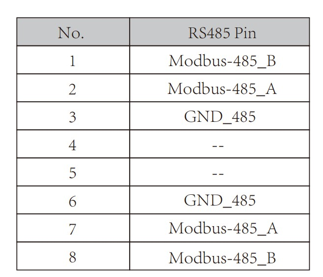
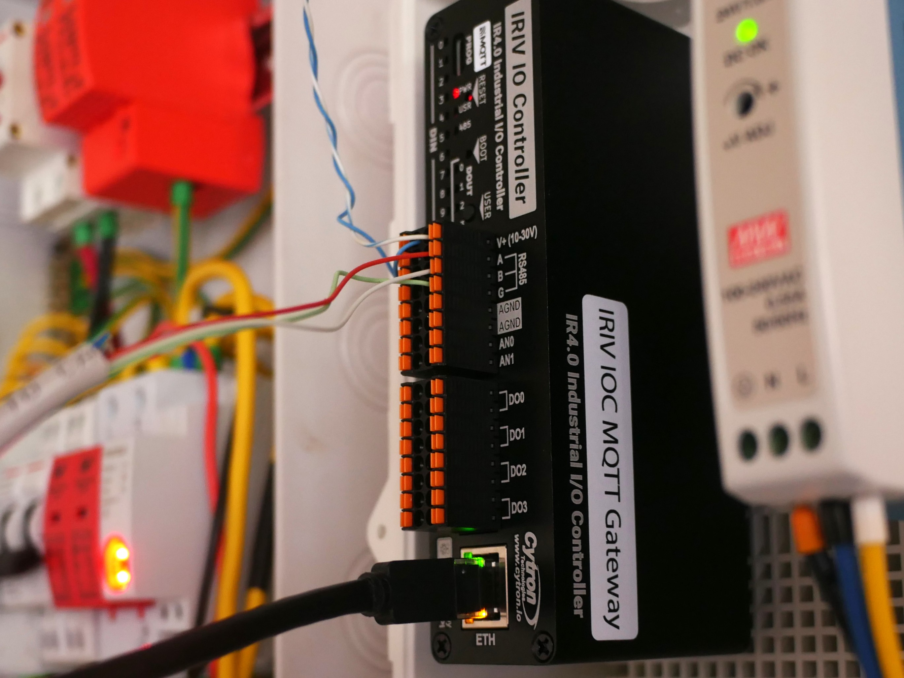
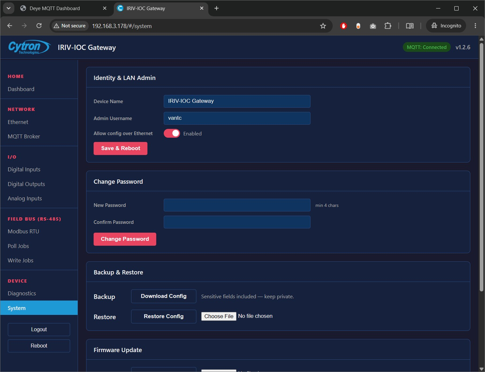
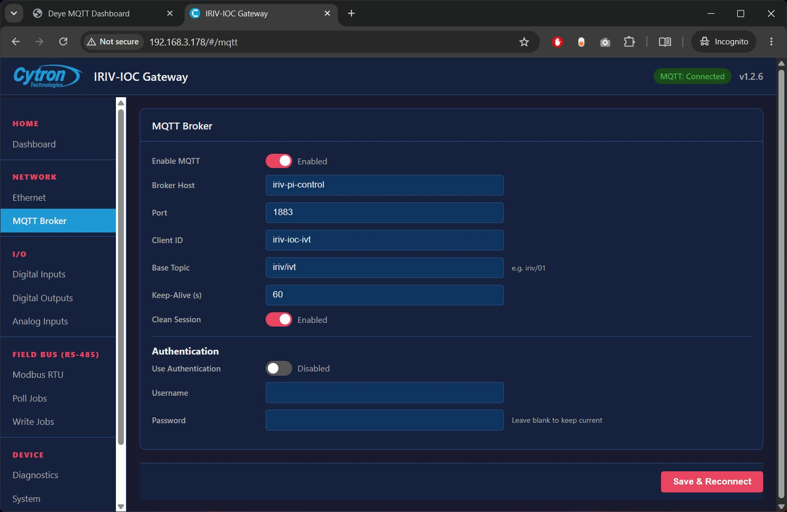
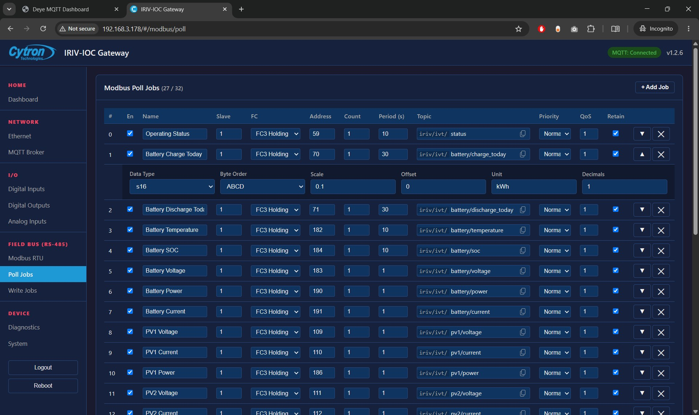
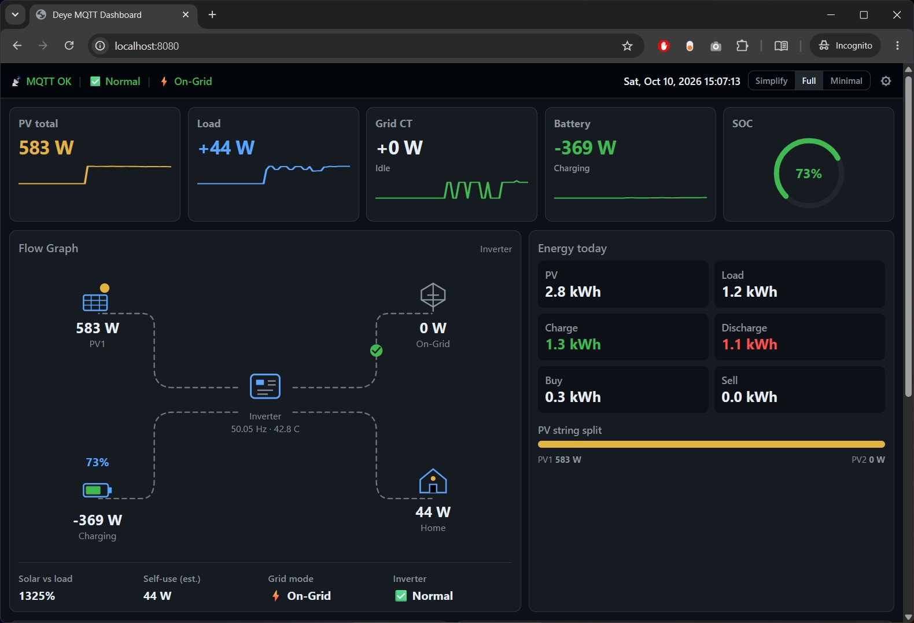

# IRIV IOC MQTT Gateway — Deye SG06

> Vietnamese: [README-vn.md](README-vn.md)

Cytron **IRIV IOC MQTT Gateway** polls the Deye inverter over **Modbus RTU (RS485)** and publishes scaled values to MQTT under `iriv/ivt/...`.


**Product page (firmware downloads):** [IRIV IO Controller MQTT — Cytron](https://www.cytron.io/p-iriv-io-controller-mqtt-ir4.0-industrial-i-o-controller-with-mqtt-ready)

**One Modbus master per RS485 bus.** Do not run this gateway on the same A/B wires as ESPHome / ESP32.

| Item | Value |
|------|--------|
| Baud | **9600** 8N1 |
| Slave ID | **1** |
| MQTT base | `iriv/ivt` |
| Payload | JSON `{"value": <number>}` |
| Firmware | Prefer **≥ V1.2.6** for the 27-job config |

## Files

| File | Role |
|------|------|
| [`iriv-ioc-config.json`](iriv-ioc-config.json) | Import on firmware **≥ V1.2.6** (27 jobs, full PV2) |
| [`iriv-ioc-config-26.json`](iriv-ioc-config-26.json) | Older firmware only (drops PV2 Current) |
| [`_gen_iriv_jobs.py`](_gen_iriv_jobs.py) | Regenerates both JSON files |
| [`iriv_deye_mqtt.yaml`](iriv_deye_mqtt.yaml) | Home Assistant MQTT sensor package |
| [`docker-compose.yml`](docker-compose.yml) + [`mosquitto.conf`](mosquitto.conf) | Local Mosquitto (1883 + WebSocket 9001) |

Device web login in the JSON templates: user **`admin`**, password **`12345678`** (stored as `adminPassHash` / `adminPassSalt`). Change this after first setup if the device is reachable beyond your LAN.

Regenerate jobs (do not hand-edit dozens of poll slots if avoidable):

```bash
python iriv-ioc-mqtt-gateway/_gen_iriv_jobs.py
```

---

## Hardware wiring (Deye SUN-6K-SG06LP1 ↔ IRIV)

Use the inverter **datalogger / meter RS485** RJ45 — **not** the BMS **CAN** RJ45. Cut one end off a standard Ethernet cable and land the three signal wires on the IRIV **RS485** screw/push terminals (**A**, **B**, **G**).

**RJ45 pin order on the Deye end:** latch facing **down**, pins numbered **1 → 8 left to right**.



| RJ45 pin (Deye) | Signal | Wire colour (lab cable) | IRIV terminal |
|-----------------|--------|-------------------------|---------------|
| **1** | Modbus-485_B | White | **B** |
| **2** | Modbus-485_A | Red | **A** |
| **3** | GND_485 | Light blue | **G** |

Pins **7** / **8** / **6** on the Deye port duplicate A / B / GND; this lab cable uses **1–2–3** only.



If the bus is silent, swap **A** and **B** once and re-check baud **9600**, slave **1**.

---

## 1. Run Mosquitto with Docker

From this folder:

```bash
cd iriv-ioc-mqtt-gateway
docker compose up -d
```

| Port | Use |
|------|-----|
| **1883** | MQTT TCP — IRIV gateway, HA MQTT integration |
| **9001** | MQTT over WebSockets — [`web/`](../web/) dashboard |

Check the broker:

```bash
docker compose logs -f mosquitto
```

Point the IRIV MQTT host at the machine running Docker (hostname or LAN IP). The templates default to `iriv-pi-control`; edit on the device or re-export after changing host in the JSON if needed.

Stop:

```bash
docker compose down
```

Do **not** expose 1883/9001 to the public internet without TLS and authentication.

---

## 2. First-time restore on the IRIV IOC MQTT Gateway

### Update firmware first

Before importing this repo’s JSON, flash the **latest** IRIV IOC MQTT Gateway firmware from Cytron:

1. Open the product page: [IRIV IO Controller MQTT](https://www.cytron.io/p-iriv-io-controller-mqtt-ir4.0-industrial-i-o-controller-with-mqtt-ready).
2. Download the newest firmware package / release notes from that page (or the linked Cytron firmware-update tutorial).
3. Follow Cytron’s **Factory Reset and Firmware Update** steps for the IRIV IOC MQTT Gateway until the device reports a current build.
4. Prefer firmware **≥ V1.2.6** so you can import the full 27-job [`iriv-ioc-config.json`](iriv-ioc-config.json). Older builds still wipe the job list at a 27th enabled poll job — use [`iriv-ioc-config-26.json`](iriv-ioc-config-26.json) only if you cannot upgrade yet.

### Restore / import config over USB

On a new, factory-reset, or freshly updated gateway, configuration is done over the USB gadget Ethernet interface:

1. Connect **USB-C** from the IRIV IOC MQTT Gateway to your PC.
2. Wait until the host gets a USB Ethernet / RNDIS link (Windows may install a driver).
3. Open a browser to **`http://10.0.0.1`**.
4. Log in with the credentials in the JSON template (**`admin` / `12345678`**) or the factory defaults if you have not imported yet (Cytron docs often ship `admin` / `admin` until you change the password).
5. Open **System** (or equivalent). Enable **Allow config over Ethernet** if you will restore from the LAN IP later, then use **Restore** to import the poll config:
   - Firmware **≥ V1.2.6** → [`iriv-ioc-config.json`](iriv-ioc-config.json)
   - Older firmware → [`iriv-ioc-config-26.json`](iriv-ioc-config-26.json)

   

6. Set the MQTT **Broker** page: host = your Mosquitto IP/hostname, port **1883**, base topic **`iriv/ivt`**, auth off unless your broker requires it.

   

7. After a successful restore, open the Modbus **poll job** list and confirm the enabled jobs are present (27 on V1.2.6+, or 26 on the older JSON).

   

8. Wire **RS485 A / B / G** as in [Hardware wiring](#hardware-wiring-deye-sun-6k-sg06lp1--iriv) (datalogger RS485, not BMS CAN). Baud **9600**, slave **1**.
9. After Ethernet LAN is enabled, use the device’s LAN IP for later config; USB `10.0.0.1` is mainly for first bring-up.

### Try it — live MQTT after restore

With the gateway wired to the Deye, Mosquitto running, and config restored:

1. CLI smoke test:

```bash
mosquitto_sub -h <broker-host> -t "iriv/ivt/#" -v
```

You should see topics such as `iriv/ivt/battery/soc`, `iriv/ivt/pv1/power`, `iriv/ivt/load/current`.

2. Browser dashboard from [`../web/`](../web/):

```powershell
cd ../web
python -m http.server 8080
```

Open `http://127.0.0.1:8080`, point the gear dialog at `ws://<broker-host>:9001`, Connect. Live values should match the IRIV poll jobs:



---

## 3. Add sensors in Home Assistant

### Prerequisites

1. Home Assistant can reach the same Mosquitto broker as the IRIV gateway.
2. The **MQTT** integration must already be installed and configured:
   - **Settings → Devices & services → Add integration → MQTT** (or confirm MQTT is listed and connected).
   - Point it at your broker host/port (**1883**). Without this integration, the YAML package below will not create working entities.

### Option A — packages folder (recommended)

1. Copy [`iriv_deye_mqtt.yaml`](iriv_deye_mqtt.yaml) into your HA config, e.g. `config/packages/iriv_deye_mqtt.yaml`.
2. Ensure packages are enabled in `configuration.yaml`:

```yaml
homeassistant:
  packages: !include_dir_named packages
```

3. Restart Home Assistant (or reload YAML / MQTT entities if your version supports it).
4. Entities appear under device **Deye SG06 (IRIV)**; each sensor reads `value_json.value` from `iriv/ivt/...`.

### Option B — File Editor + `configuration.yaml`

If you prefer not to manage a separate upload path:

1. Install the **File editor** add-on (Settings → Add-ons → File editor) if it is not already installed.
2. Open File editor and edit `/config/configuration.yaml` (shown as `/homeassistant/configuration.yaml` on some supervised / OS layouts).
3. Either:
   - enable the packages include as in Option A and place `iriv_deye_mqtt.yaml` under `packages/`, or
   - paste / merge the `mqtt:` sensor block from [`iriv_deye_mqtt.yaml`](iriv_deye_mqtt.yaml) directly into `configuration.yaml`.
4. Check configuration, then restart Home Assistant.

---

## Poll periods (template)

| Group | Period |
|-------|--------|
| Voltage / Current / Power | **1 s** |
| Temp / SOC / frequency / status | **10 s** |
| `*_today` energy | **30 s** |

Field-verified scales (SG06): charge/discharge today **70 / 71**; PV current **0.1** A; Grid current **160** ×**0.01** A; Load current **179** ×0.01 A; Inverter frequency **193** ×0.01 Hz. Use `dataType` **s16** (`3`) for 16-bit holdings.
